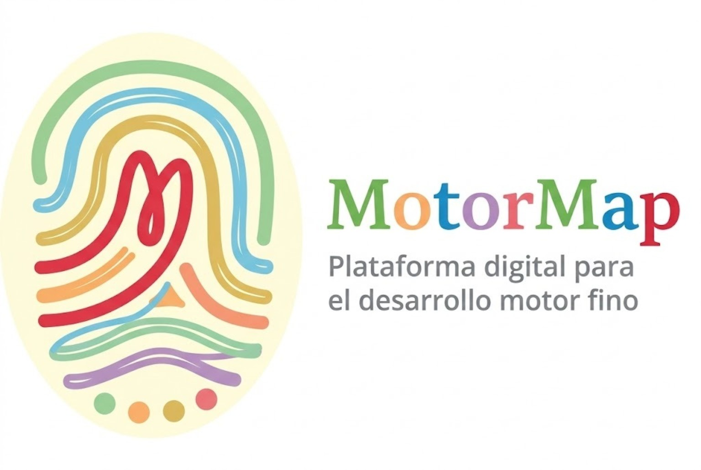

# MotorMap 🏎️✏️

> Una plataforma interactiva diseñada para potenciar el desarrollo de habilidades grafomotoras y la coordinación ojo-mano en niños a través del juego y la tecnología.



## ¿Qué es MotorMap?

**MotorMap** es una herramienta educativa innovadora que transforma los ejercicios tradicionales de trazado en una experiencia digital dinámica y motivadora. Utilizando algoritmos de análisis en tiempo real, la aplicación permite a educadores y padres realizar un seguimiento preciso del progreso motriz de los pequeños mientras ellos se divierten "conduciendo" sus trazos por diversos desafíos.

---

## Características Principales

### Lienzo de Alta Precisión
Desarrollado con **React Native Reanimated**, ofrece una experiencia de dibujo fluida y receptiva, capturando cada detalle del movimiento del usuario con latencia mínima.

### Análisis Inteligente de Trazos
Nuestro motor de análisis evalúa cada intento basándose en métricas clave:
- **Precisión:** Comparación punto a punto con la plantilla original mediante algoritmos de distancia euclidiana.
- **Permanencia en Carril:** Detección de "salidas de pista" en actividades de seguimiento de caminos.
- **Métricas de Desempeño:** Seguimiento de la longitud del trazado, número de levantamientos del lápiz/dedo y duración total.

### Gamificación y Feedback
- **Feedback Visual:** Animaciones y efectos inmediatos al completar tareas o cometer errores para mantener el compromiso.
- **Indicadores de Progreso:** Pantallas dedicadas para visualizar el avance y las metas alcanzadas a lo largo del tiempo.
- **Interfaz Child-Friendly:** Diseño intuitivo con iconos claros y una paleta de colores vibrante y segura.

---

## ⚙️ Instalación y Configuración

Sigue estos pasos para ejecutar el proyecto en tu entorno local:

1. **Instalar dependencias:**
   ```bash
   npm install
   ```

2. **Iniciar la aplicación:**
   ```bash
   npx expo start
   ```

3. **Ejecutar en dispositivos:**
   - Usa la app **Expo Go** en tu móvil para escanear el código QR.
   - O presiona `a` para Android o `i` para iOS si tienes los simuladores configurados.

---

## Objetivo del Proyecto

El objetivo principal de **MotorMap** es servir como puente entre la terapia ocupacional, la educación especial y el hogar. Proporciona una base de datos objetiva sobre la evolución de la motricidad fina, facilitando intervenciones más tempranas, divertidas y personalizadas.

---
Desarrollado con para el desarrollo infantil.

